# Plots (Named)

### Plot A1 — Perplexity vs Experts (Fixed FLOPs)
- y: validation perplexity
- x: `E`
- hue: seed (ribbon optional)

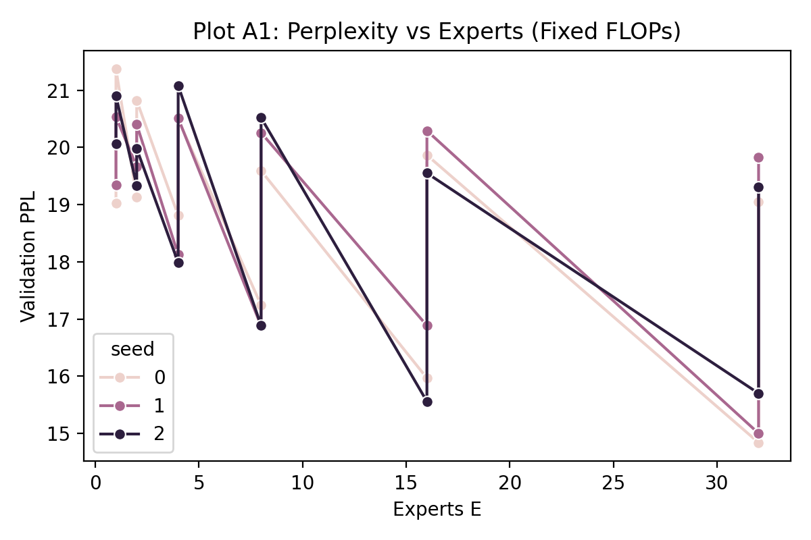

### Plot A2 — Learning Curves @Fixed FLOPs
- y: validation perplexity
- x: tokens seen
- hue: `E`

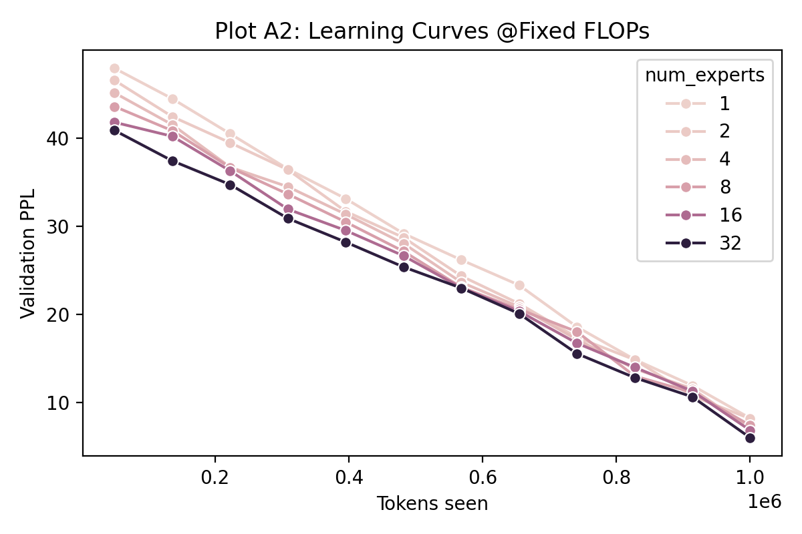

### Plot A4 — Throughput vs Experts (Fixed FLOPs)
- y: tokens/s
- x: `E`

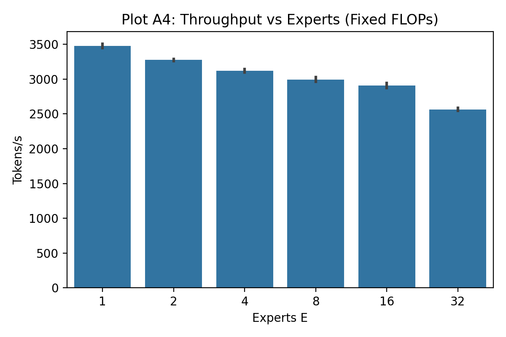

### Plot A6 — Router Entropy vs Experts
- y: mean router entropy (per step)
- x: `E`

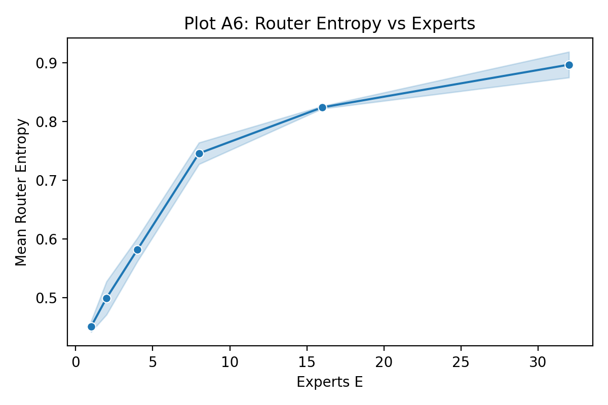

### Plot B1 — Perplexity vs Experts (Fixed Params)
- y: validation perplexity
- x: `E`

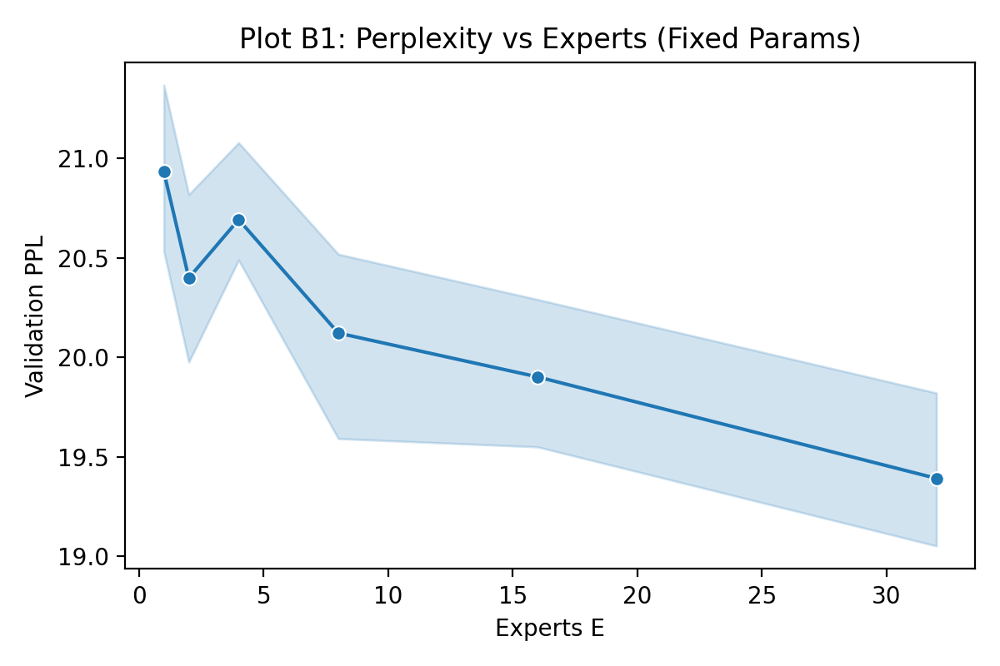

### Plot C1 — Perplexity vs FLOPs/Token (All Regimes)
- y: validation perplexity
- x: forward FLOPs/token proxy
- hue: `E`
- style: regime (`flops` vs `params`)

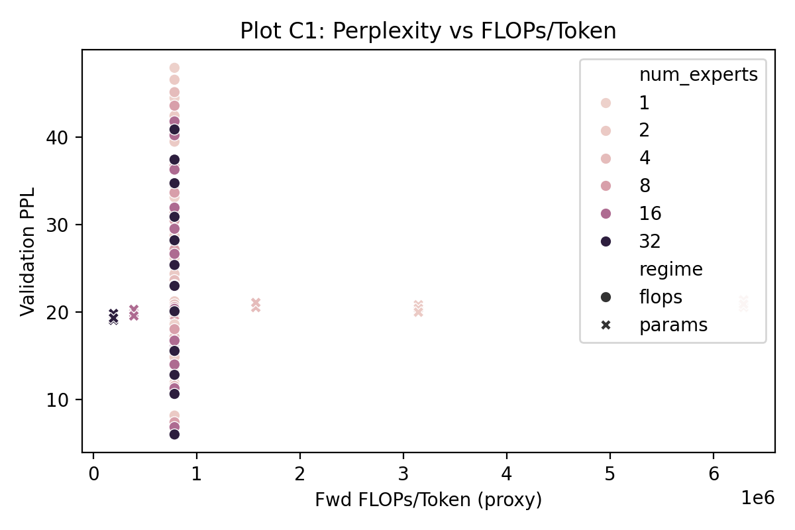

!!! info "Saved to"
    During development, mock plots are generated into `docs/assets/plots/`.
### Plot A3 — PPL vs Active Params/Token (Sanity)
- y: validation perplexity
- x: active params per token (proxy)

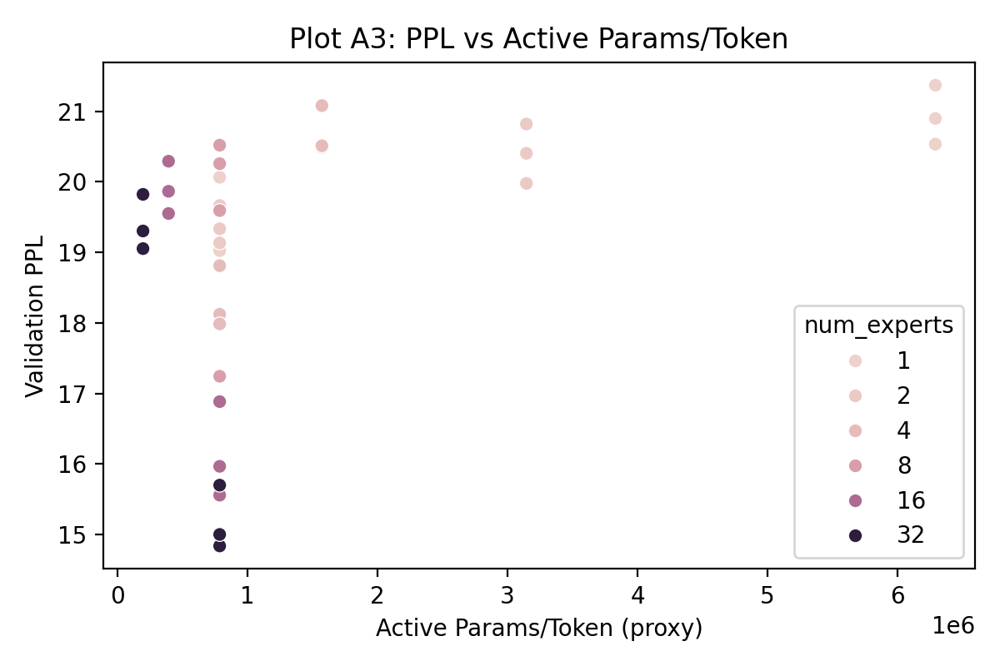

### Plot A5 — Expert Usage Histogram
- Per `E`, average fraction of tokens per expert (bars)

Samples:

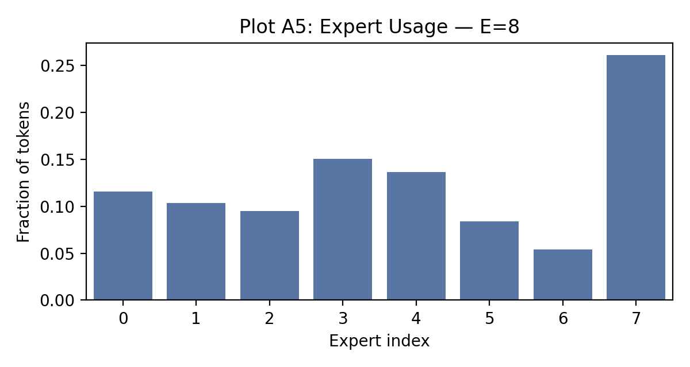
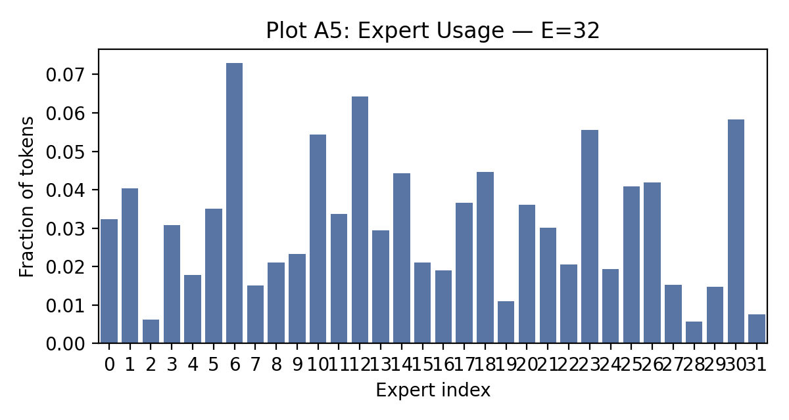

### Plot A7 — Load-Balance Loss (avg)
- y: average auxiliary loss during training
- x: `E`

### Plot B2 — PPL vs FLOPs/Token (Iso-Params)
- y: validation perplexity
- x: forward FLOPs/token (proxy)

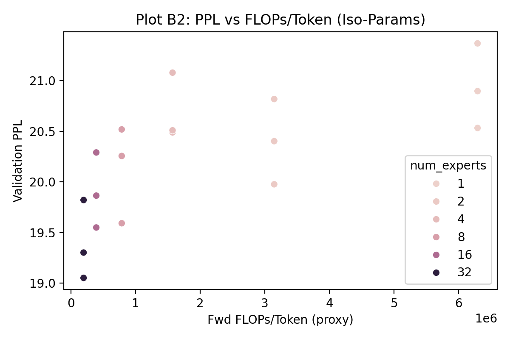

### Plot B3 — FLOPs/Token vs Experts (Fixed Params)
- y: forward FLOPs/token (proxy)
- x: `E`

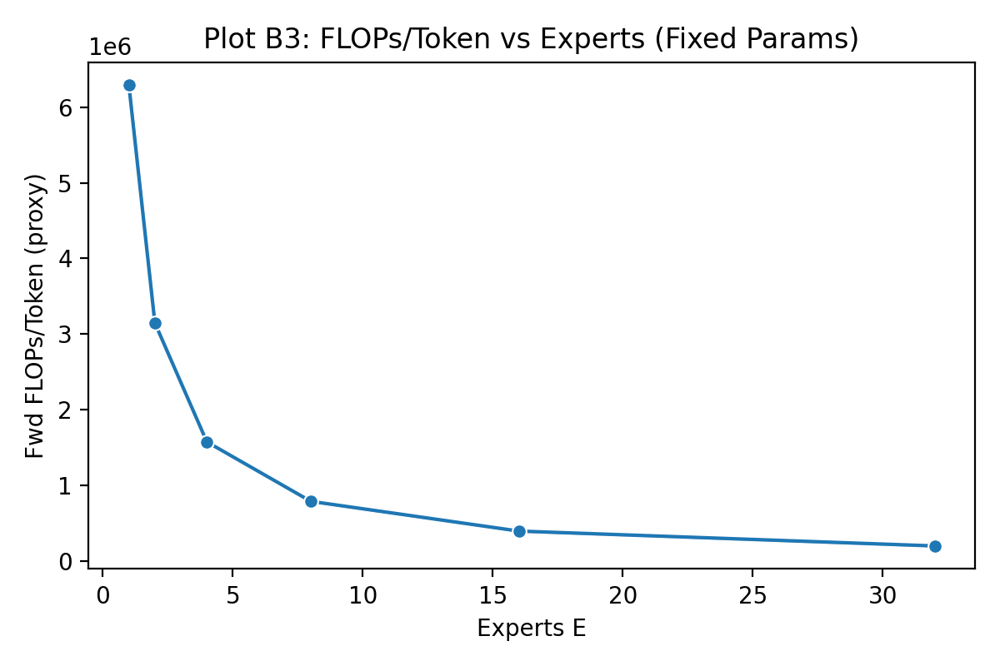

### Plot C2 — Perplexity vs Total Expert Params
- y: validation perplexity
- x: total expert parameters

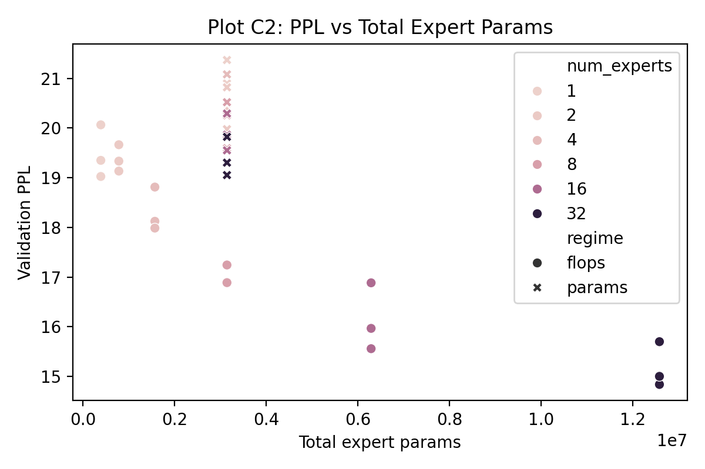

### Plot C3 — Heatmap: PPL over (E, d_ff_expert)
- 2D pivot of mean PPL; contours implicit

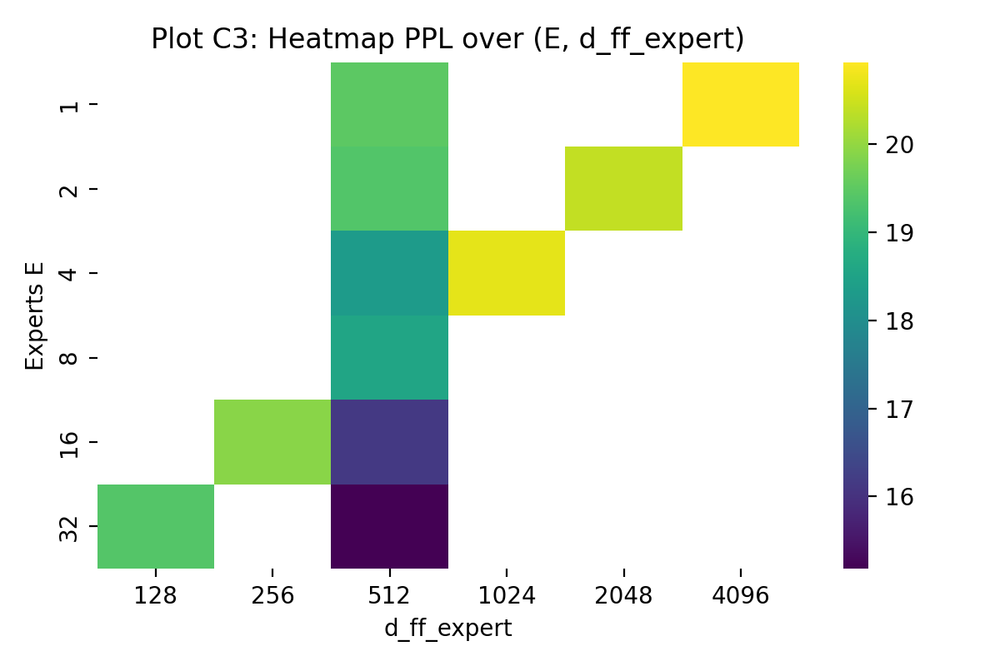

### Plot D1 — Peak Memory vs Experts
- y: GB
- x: `E`

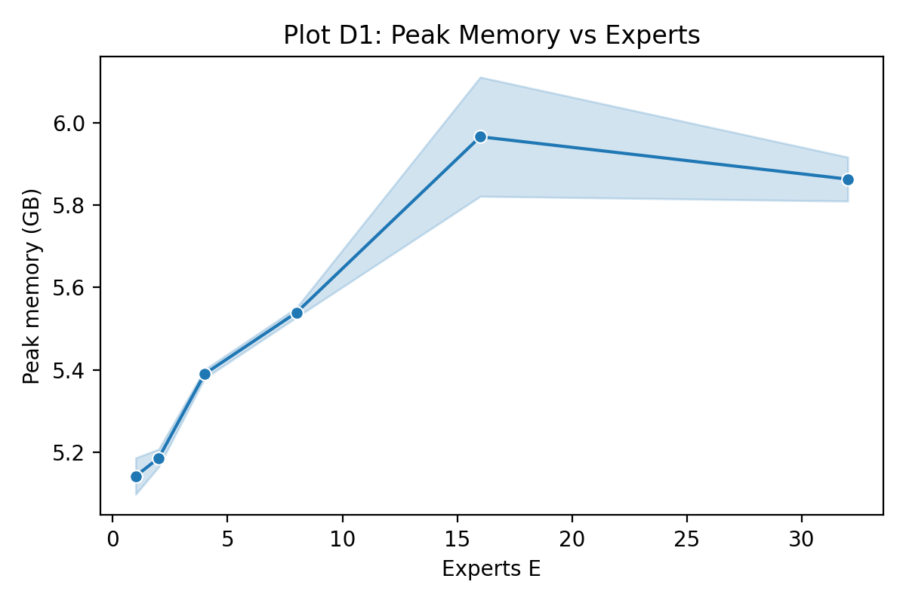

### Plot D2 — sec / 1M tokens vs Experts
- y: seconds per million tokens
- x: `E`

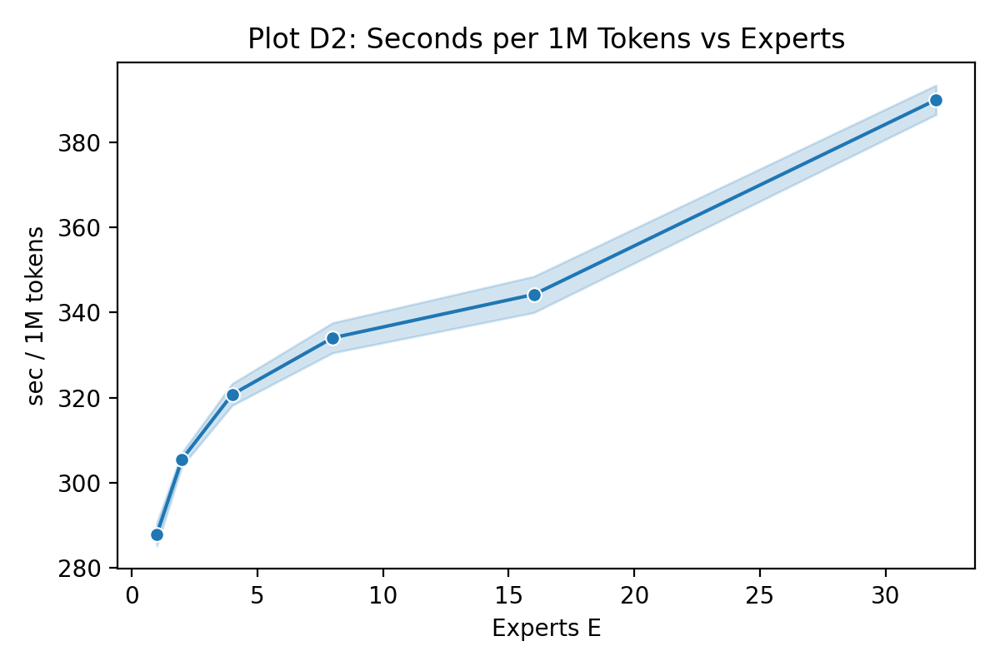

---

#### Re-generate Mock Plots

- Generate: `python experiments/generate_mock_plots.py --out docs/assets/plots`
- Theme: plots use Seaborn with `sns.set_theme(style="whitegrid")` for consistency.
